# Unihub opis
Unihub to prosta aplikacja do organizacji zadań z priorytetem. Skupia się na planowaniu zadań krótkoterminowych i jednorazowych. Priorytet jest obliczany na podstawie terminu wykonania zadania i czterech parametrów podawanych przez użytkownika (fun, difficulty, importance, time).

Użytkownik przy tworzeniu zadania może podać:
- Jak bardzo chce je zrobić (fun)
- Jak trudne jest do zrobienia (difficulty)
- Jak ważne jest żeby je zrobić (importance)
- Jak długo mu zajmie (time)

### Dostępne funkcjonalności
- Rejestracja i logowanie użytkownika.
- Zarządzanie zadaniami (CRUD, przypinanie zadań,oznaczanie ukończonych zadań).
- Zarządzanie indywidualnymi kategoriami (CRUD).
- Archiwum ukończonych zadań.
- Zarządzanie preferencjami użytkownika (usuwanie ukończonych zadań, wpływ poszczególnych paramterów na priorytet).
- Panel administratora do zarządzania użytkownikami.

# Implementacja wymagań

### Architektura aplikacji

### Diagram ERD
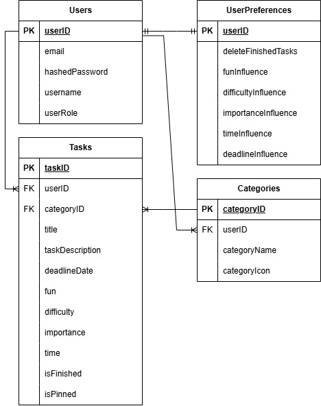

### Design desktop

Przed przystąpieniem do implementacji zaprojektowałam część widoków w Figma, ale w trakcie implementacji zdecydowałam się na wiele zmian. Jednak główny motyw aplikacji pozostał niezmienny.

  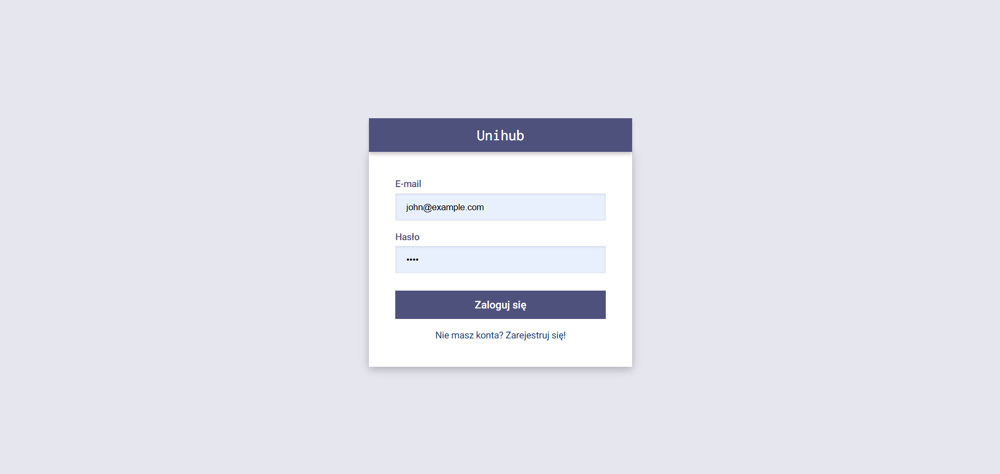
  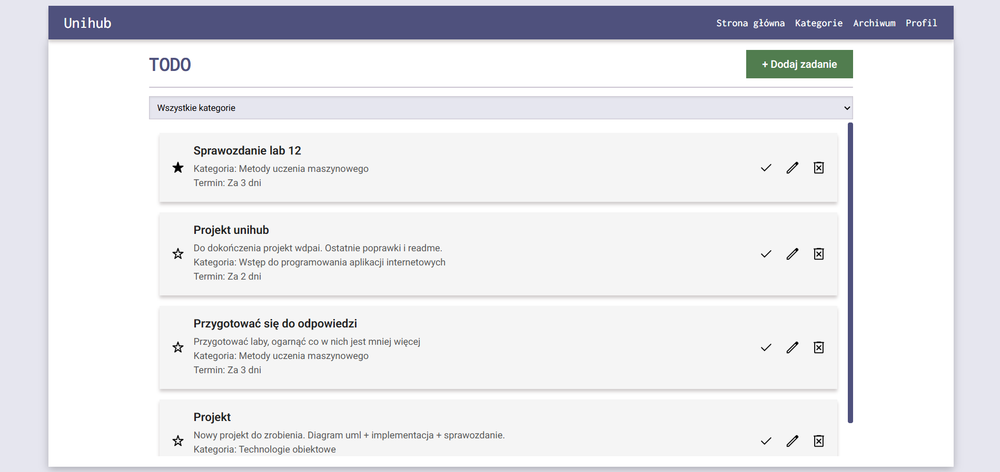 
  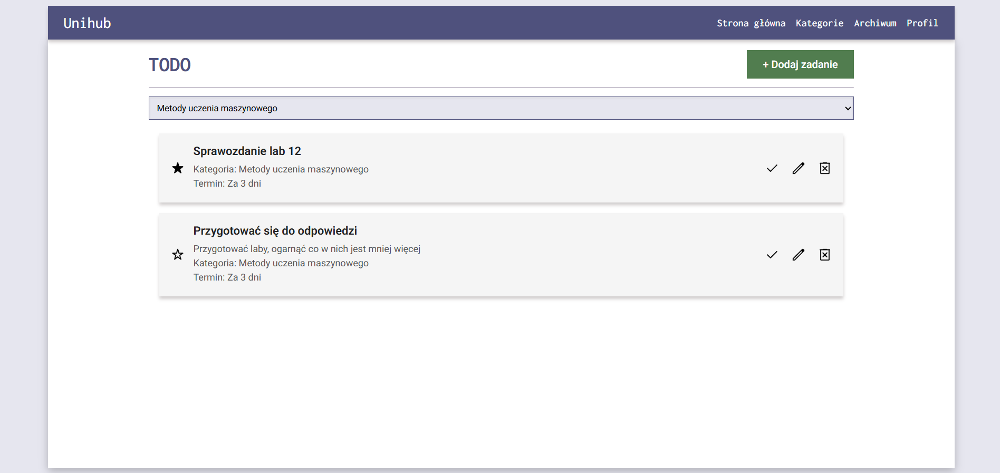
  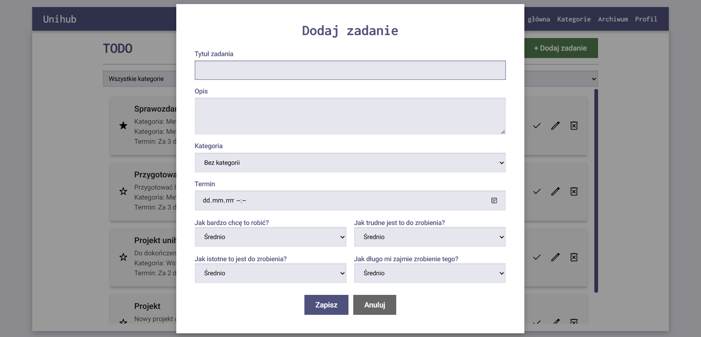
  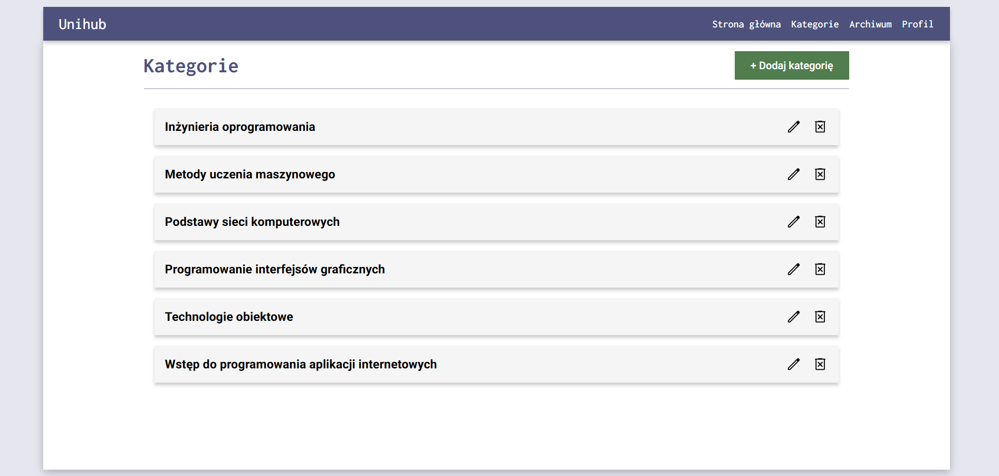 
  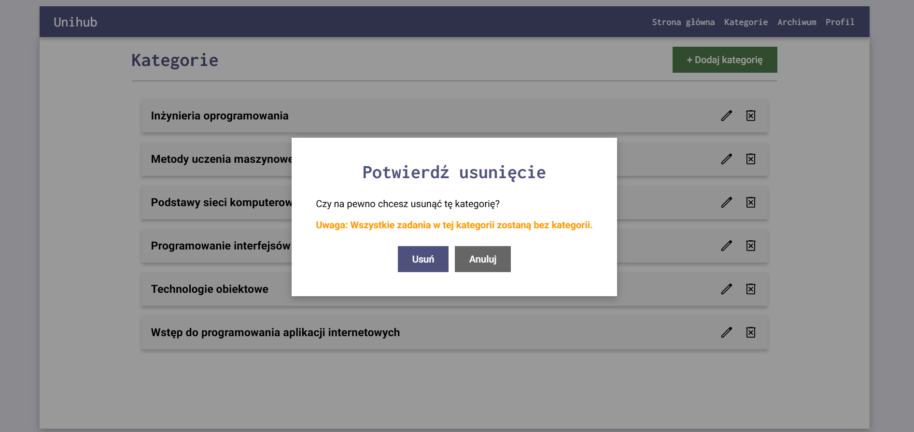 
  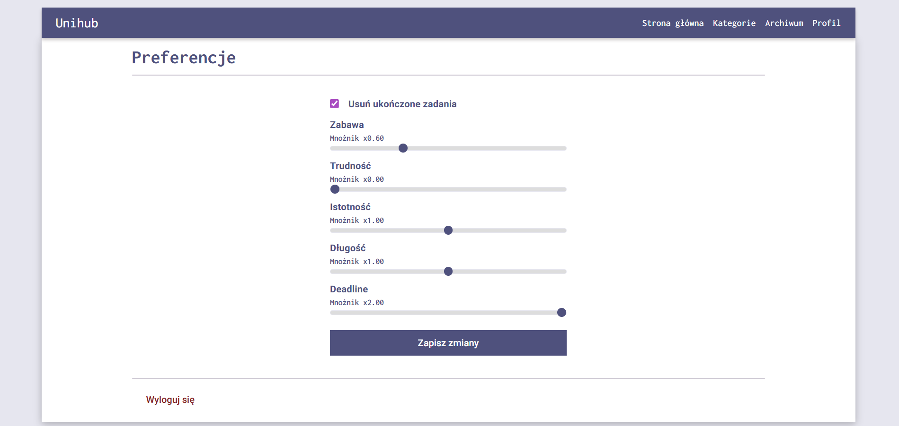 

### Responsywność - widoki mobile

  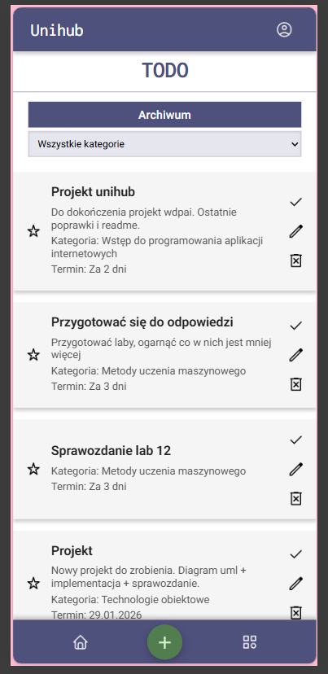
  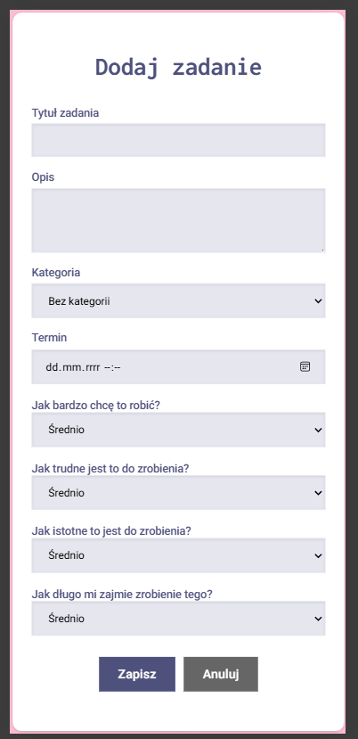 
  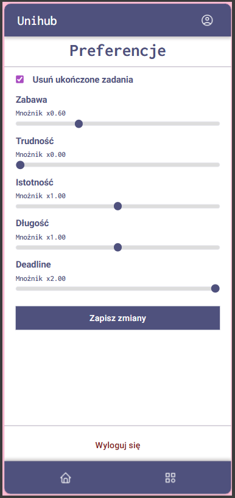
  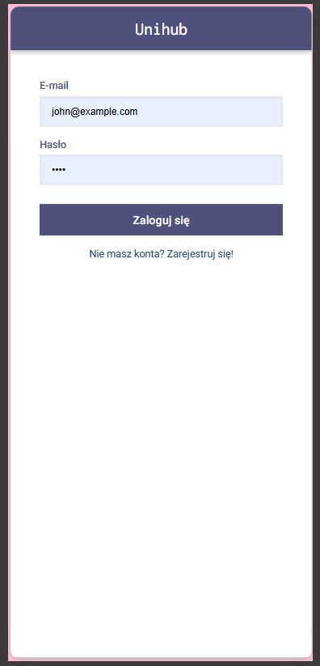 

### Pełne wylogowanie razem z niszczeniem sesji

    public function logout(){
        if (session_status() === PHP_SESSION_NONE) {
            session_start();
        }

        session_unset(); 
        session_destroy();

        if (ini_get("session.use_cookies")) {
            $params = session_get_cookie_params();
            setcookie(
                session_name(),
                '',
                time() - 42000,
                $params["path"],
                $params["domain"],
                $params["secure"],
                $params["httponly"]
            );
        }
        
        $this->redirect('login');
    }

### Wyzwalacze, funkcje i widoki w bazie
    -- Automatycznie tworzy domyślne preferencje użytkownika
    CREATE OR REPLACE FUNCTION create_user_preferences()
    RETURNS TRIGGER AS $$
    BEGIN
        -- Tworzy preferencje tylko dla uzytkowników, nie dla adminów
        IF NEW.userRole = 'user' THEN
            INSERT INTO UserPreferences (userID)
            VALUES (NEW.userID);
        END IF;
        RETURN NEW;
    END;
    $$ LANGUAGE plpgsql;

    -- Usuwa ukończone zadania jeżeli takie preferencje ma użytkownik
    CREATE OR REPLACE FUNCTION auto_delete_finished_tasks()
    RETURNS TRIGGER AS $$
    DECLARE
        should_delete BOOLEAN;
    BEGIN
        SELECT deleteFinishedTasks INTO should_delete
        FROM UserPreferences
        WHERE userID = NEW.userID;
        
        IF should_delete AND NEW.isFinished = TRUE AND OLD.isFinished = FALSE THEN
            DELETE FROM Tasks WHERE taskID = NEW.taskID;
            RETURN NULL; -- Powstrzymuje przed aktualizacją zadania
        END IF;
        
        RETURN NEW;
    END;
    $$ LANGUAGE plpgsql;

    -- Przy tworzeniu użytkownika automatycznie tworzy jego preferencje
    CREATE TRIGGER trigger_create_user_preferences
        AFTER INSERT ON Users
        FOR EACH ROW
        EXECUTE FUNCTION create_user_preferences();

    -- Wywołuje usuwanie ukończonego zadania w zależności od preferencji użytkownika
    CREATE TRIGGER trigger_auto_delete_finished_tasks
        BEFORE UPDATE ON Tasks
        FOR EACH ROW
        WHEN (NEW.isFinished IS DISTINCT FROM OLD.isFinished)
        EXECUTE FUNCTION auto_delete_finished_tasks();

    -- Widok wyświetla tylko aktywne zadania
    CREATE OR REPLACE VIEW active_tasks AS
    SELECT * FROM Tasks
    WHERE isFinished = FALSE;

    -- Widok wyświetla tylko zakończone zadania
    CREATE OR REPLACE VIEW finished_tasks AS
    SELECT * FROM Tasks
    WHERE isFinished = TRUE;

### Bezpieczeństwo
- Ochrona przed SQL injection (prepared statements/brak konkatenacji SQL)
- Przy logowaniu brak informacji czy email istnieje
- Walidacja formatu adresu email po stronie serwera
- UserRepository jako singleton
- Metoda login/register przyjmuje dane tylko na POST, na GET renderuje widok
- CSRF token w formularzu logowania i rejestracji
- Ograniczam długość wejścia (email, hasło, username)
- Hasło przechowywane jako hash (PASSWORD_BCRYPT)
- Hasła nigdy nie są logowane
- Hasło nie jest przekazywane do widoków ani echo/var_dump
- Po poprawnym logowaniu regerenuję ID sesji
- Cookie ma flagi: HttpOnly, Secure, SameSite
- Waliduję złożoność hasła
- Przy rejestracji sprawdzam czy adres email jest już w bazie
- Dane wyświetlane w widokach są escapowane
- Nie pokazuję stack trace/surowych błędów użytkownikowi
- Zwracam sensowne kody HTTP
- Z bazy pobieram tylko minimalny zestaw danych o użytkowniku
- Poprawne wylogowywanie z niszczeniem sesji użytkownika
